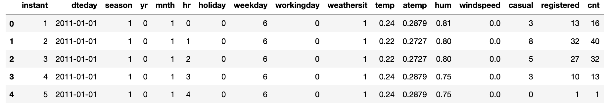
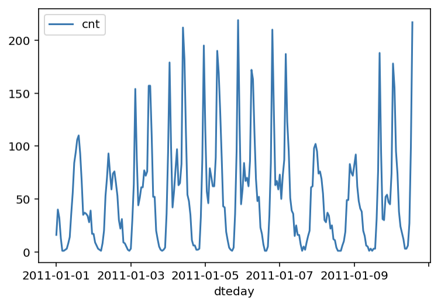

# Predicting Bike Sharing Patterns

This repository represents a solution to the first project of Udacity's Deep Learning nanodegree.

## Overview

A bike sharing system is a service in which bicycles are made available for shared use to individuals on a
short term basis for a price or free. The goal of this project was to build a neural network model that predicts the number
of borrowed bicycles in a specific day to better help bike sharing associations understand their customers' behavior and improve
their business according to it. To carry out the problem, the model was built on a real dataset which you
can find [here](https://archive.ics.uci.edu/ml/datasets/Bike+Sharing+Dataset).

## Understanding the Dataset

This dataset has the number of riders for each hour of each day from January 1 2011 to December 31 2012. The number
of riders is split between casual and registered, summed up in the `cnt` column. You can see the first few rows
of the data and a visualization of the first 10 days below.

  

  
  

## Understanding the Model
Splitting the dataset's attributes into features and target was the first step of building the nueral network. The figure below takes the features as inputs, and predicts and `cnt` as output.

